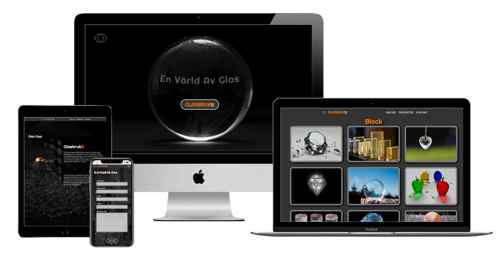

#  A GROUP PROJECT

## Team members

- HEBA SADLAH (Git Master)  
  - About Us page
- NAMIR KHALAF  
  - Product page  
  - Glassware page  
  - Blocks page  
  - Lights page  
  - Lab page  
  - Plates page  
  - Vases page  
- OTTILIA LINDELL
  - Navbar  
  - Footer  
  - Logo  
- PATRICK SVENSSON  
  - Landing page  
  - Contact Us page  
  - Wireframes  

----

## About The Project  

A group assignment at the IT programming VT, Sundsgården's Folk High School, April 2021.  
The challenge was primarily to learn how to collaborate with Git in a team, and secondly to create a website that nests at least three levels deep, to make us work with more complex file paths.  
The team decided to make a website for a fictitious glassworks company named GlasbrukIT. We opted for a dark mode design to enhance the  sparkling effects of the crystal, the heat from the furnace and melted glass, and because we really like dark mode websites.

## Multi Device Mock Up  

  

----

## Features  and UX  

- ### Landing page  

  - We make sure the users get a clear sense of where they have arrived by showing a globe, with a map of the world, made of glass, the company logo together with the company name. The company name comes in form of a large button, making it easy for the users to navigate to the next page. To make it even more obvious what the company does, we present a large heading with the words "A World Of Glass".  

- ### About Us page  

  - With the crystal glasswork softly filtered to a dark shimmer in the background, and an image of glass blowing in action, we give some information and history of the company.  
  
    By using the links in the navbar the users can navigate further into the website. The navbar remains at the top of the screen throughout the visit making it easy for the users to navigate.  
    In the footer there are icons that will take the users to the company's social media. The footer can be found at the bottom of each page.  
    The scrollbar has been given an orange colour on dark background for better contrast and colour theme consistancy.

- ### Produkts page  

  - The produkt page is made as a large hub.
  From this page the users can navigate to the product groups  that the company presents.  

- ### Products Sub Group pages

  - These pages show the glassworks that the company produces.  

- ### Contact Us page  

  - On this page the users will find a user friendly form where they can send a message to the company. The users can easily navigate inside the form by tab or mouse due to an effective focus styling.  
  The send button has inherited the logo design for for enhanced UX and consistancy.  

## Features Left To Implement  

- Add the ability for the user to change language.

## Technologies Used  

- HTML5
- CSS3
- SASS
- Javasqript
- Git
- Fontawesome
- Google Fonts
- Tiny.png
- Photoshop
- Figma
  - For wireframes
- Techsini
  - For multiple device mock up

## Media

- Pixabay
